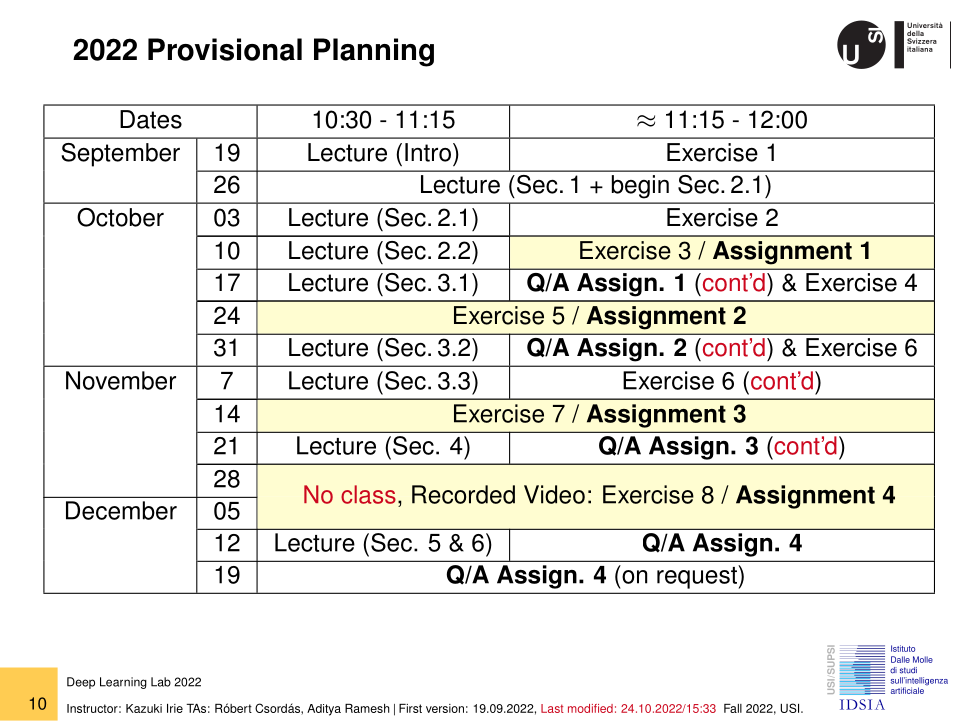

# Course materials for "Deep Learning Lab" 2020, 2021, 2022

This repository contains the course materials for an introductory lecture on deep learning, "Deep Learning Lab", taught by [Kazuki Irie](https://scholar.google.com/citations?hl=en&user=-gZ-BdwAAAAJ&view_op=list_works&sortby=pubdate) at [University of Lugano / Università della Svizzera italiana](https://www.usi.ch/en), Switzerland, during the fall semesters of 2020, 2021, and 2022.

* [[Main Lecture Slides]](https://github.com/kazuki-irie/dll-course-lugano/blob/master/slides_dll.pdf)

* [Exercise 1](https://github.com/kazuki-irie/dll-course-lugano/blob/master/exercises/activities_01/activities.pdf): Python/Numpy
* [Exercise 2](https://github.com/kazuki-irie/dll-course-lugano/blob/master/exercises/activities_02/activities.pdf): PyTorch Basics
* [Exercise 3 / Assignment 1](https://github.com/kazuki-irie/dll-course-lugano/blob/master/exercises/activities_03/assignment1.pdf): Polynomial Regression
* [Exercise 4](https://github.com/kazuki-irie/dll-course-lugano/blob/master/exercises/activities_04/activities.pdf): Feedforward Neural Networks & Classification
* [Exercise 5 / Assignment 2](https://github.com/kazuki-irie/dll-course-lugano/blob/master/exercises/activities_05/assignment2.pdf): Convolutional Neural Networks & Image Classification
* [Exercise 6](https://github.com/kazuki-irie/dll-course-lugano/blob/master/exercises/activities_06/activities.pdf): Recurrent Neural Networks & Introduction to Language Modeling
* [Exercise 7 / Assignment 3](https://github.com/kazuki-irie/dll-course-lugano/blob/master/exercises/activities_07/assignment3.pdf): Recurrent Neural Networks & Language Modeling, Text Generation
* [Exercise 8 / Assignment 4](https://github.com/kazuki-irie/dll-course-lugano/blob/master/exercises/activities_08/assignment4.pdf): Transformers & Mathematical Problem Solving

## Schedule 2022
</img>

## Content
</img>

## Course Philosphy
</img>

## Acknowledgement
The course structure and several exercises were initially inspired by the former course by Paulo Rauber. The successful running of this course was made possible with the support of teaching assistants: Imanol Schlag, Aleksandar Stanić, Aditya Ramesh and Róbert Csordás.
